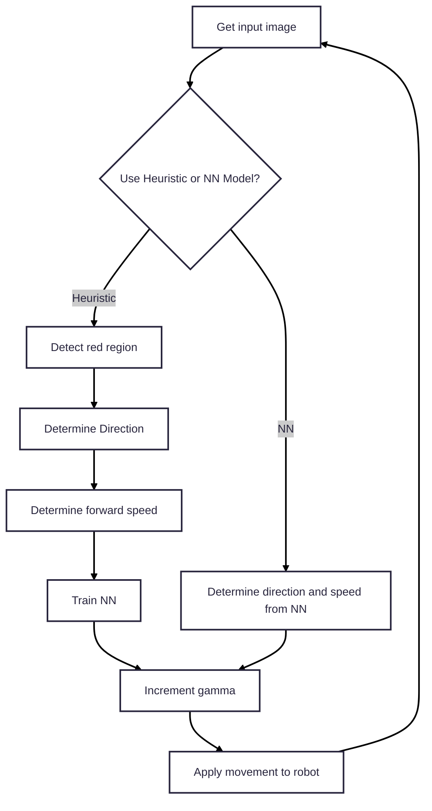

# FollowTheRed
A Jetson-powered robotics project focused on dynamic object tracking. This project aims to make a JetBot detect and follow a moving red box in real-time, using a custom movement strategy.

## Algorithm

